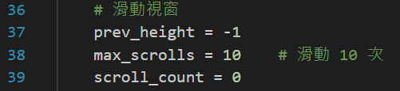

# crawler_for_unsplash

### Use BeautifulSoup & Selenium to download images

Image Source : [unsplash](https://unsplash.com/)

```pip install beautifulsoup4 selenium requests```

>I'm not sure if you need to use chromedriver. Just in case, you can download.
>1. Check your Chrome Version
>settings -> about chrome -> your chrome version
>
>2. [Chrome Driver Download](https://developer.chrome.com/docs/chromedriver/downloads?hl=zh-tw)
>If you don't see a version here that works for you, go to [Chrome for Testing(CfT)](https://googlechromelabs.github.io/chrome-for-testing/)
>
>3. After compressing the zip file, just put the exe file and the program in the same folder.


---

***crawler_small_img.py***

>crawler_small_img.py Reference : [Crawler Download Image](https://github.com/mikeku1116/python-image-downloader)\
>\
>This program is more simple and easier to understand.\
>\
>Just follow the reference to run the program.
>>Things that need to be adjusted before each execution of the program.
>>
>>1. input_image variable is search keyword
>>
>>
>>2. img class is different, you should find yours
>>3. limit variable can change number of images
>>


***crawler_large_img.py***

>crawler_large_img.py is referenced from everywhere, so it has no reference.\
>\
>But in crawler_small_img.py, only up to 20 pictures can be downloaded because there is a button called "Load more", you can see more pictures after clicking this button.\
>\
>Besides, after click the button, only got 40 pictures. If you want to get more pictures, just add sliding window function.
>>Things that need to be adjusted before each execution of the program.
>>
>>1. input_image variable is search keyword
>>
>>
>>2. button class is different, you should find yours
>>
>>
>>3. sliding window setup, can change number of strolls
>>
>>
>>4. img class is different, you should find yours
>>5. limit variable can change number of images
>>

